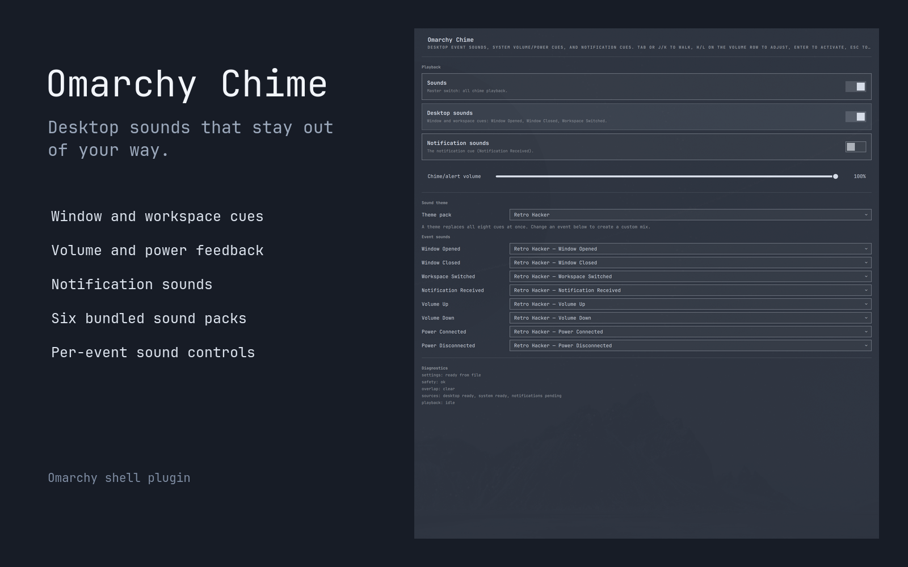

# Omarchy Chime

Omarchy Chime adds short sounds to the Omarchy desktop.



It can play a sound when you:

- open or close a window;
- change workspace;
- turn the volume up or down;
- connect or disconnect power;
- receive a notification.

You can mute Chime, change its volume, choose a sound pack, or choose a different sound for each event.

## Install

Install and enable the plugin:

```sh
omarchy plugin add https://github.com/rogersmitha51/OmarchyChime.git --enable
```

To install from a local clone instead:

```sh
omarchy plugin add /path/to/OmarchyChime --enable
```

Chime needs:

- Omarchy;
- PipeWire tools (`pw-play` and `wpctl`);
- UPower;
- the freedesktop sound theme;
- Python D-Bus and GObject packages for notification sounds.

Chime runs inside Omarchy Shell with your user permissions. It starts a local Python helper to observe notification events. It does not use `sudo`, install hooks, remote services, or remote builds.

## Open the settings

Click the Chime bell in the top bar, or run:

```sh
omarchy-shell shell toggle omarchychime.sounds '{}'
```

The settings panel lets you:

- turn all sounds on or off;
- change the Chime volume;
- turn desktop sounds on or off;
- turn notification sounds on or off;
- choose a sound pack;
- choose a sound for each event.

Changes are saved automatically.

## Bar controls

- **Left click:** open or close the settings panel.
- **Right click:** mute or unmute Chime.
- **Mouse wheel:** change the Chime volume in 5% steps.

Move the bell to another part of the bar with:

```sh
omarchy bar move omarchychime.sounds --section left
omarchy bar move omarchychime.sounds --section center
omarchy bar move omarchychime.sounds --section right
```

## Sound packs

Chime includes six sound packs:

- Zen Wood
- Ceramic Drop
- Kalimba
- Deep Resonance
- Sonar
- Retro Hacker

You can also use the system sounds or make a custom mix.

## Command line controls

Use these commands while Omarchy Shell is running:

```sh
# Show the current state
omarchy-shell chime status

# Mute or unmute
omarchy-shell chime mute
omarchy-shell chime unmute

# Set Chime volume from 0 to 1
omarchy-shell chime volume 0.35

# Turn groups of sounds on or off
omarchy-shell chime desktop on
omarchy-shell chime desktop off
omarchy-shell chime notifications on
omarchy-shell chime notifications off

# List and choose sound packs
omarchy-shell chime packs
omarchy-shell chime pack zen-wood

# List sounds and choose one for an event
omarchy-shell chime sounds
omarchy-shell chime sound windowOpened device-added

# Preview an event sound
omarchy-shell chime preview notificationReceived

# Show all commands
omarchy-shell chime help
```

Event names are:

- `windowOpened`
- `windowClosed`
- `workspaceSwitched`
- `notificationReceived`
- `volumeUp`
- `volumeDown`
- `powerConnected`
- `powerDisconnected`

Choose the sound ID `none` if you want one event to stay silent.

## How Chime behaves

Chime is designed to stay quiet when a sound could be unwanted.

- It does not play while Do Not Disturb is on.
- It does not play while the screen is locked or idle.
- It plays one sound at a time.
- It does not replay notification updates.
- It respects notifications that ask for no sound.
- Notification sounds are off by default on a new install.

Chime only observes notifications so it can play a cue. Omarchy still handles notification popups, history, actions, and Do Not Disturb. Chime does not save notification text.

Chime volume is separate from system volume. The final loudness is controlled by both settings. Chime never overrides system mute.

## Settings file

Settings are stored here:

```text
~/.config/omarchy/chime.json
```

If `XDG_CONFIG_HOME` is set, Chime uses `$XDG_CONFIG_HOME/omarchy/chime.json` instead.

You normally do not need to edit this file. Use the settings panel or commands above.

## Update

```sh
omarchy plugin update omarchychime.sounds
```

## Uninstall

```sh
omarchy plugin remove omarchychime.sounds --yes
```

Removing Chime does not remove or change Omarchy notifications.

## Development

Validate the plugin:

```sh
omarchy plugin validate .
```

Run the automated tests:

```sh
node --test tests/controller.test.mjs tests/desktop.test.mjs tests/system.test.mjs
python -m unittest discover -s tests -p observer_test.py
```

Sound pack requirements are in [SOUND_PACK_GUIDELINES.md](SOUND_PACK_GUIDELINES.md). Asset sources and licenses are in [UPSTREAM.json](UPSTREAM.json).

## License

MIT. See [LICENSE](LICENSE).
